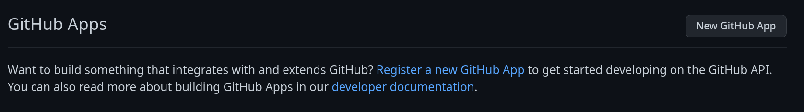
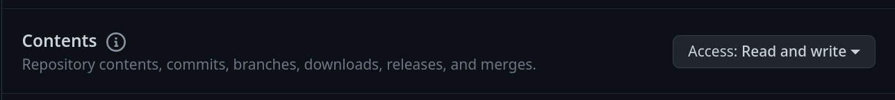
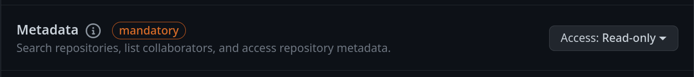
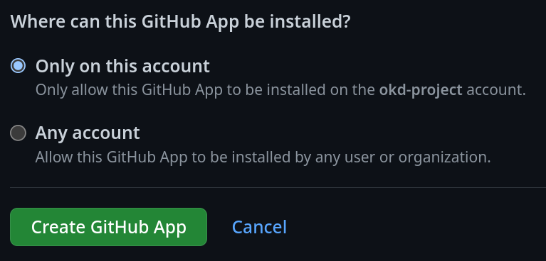
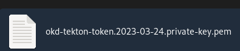
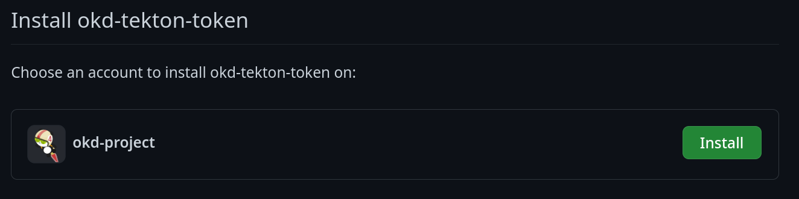
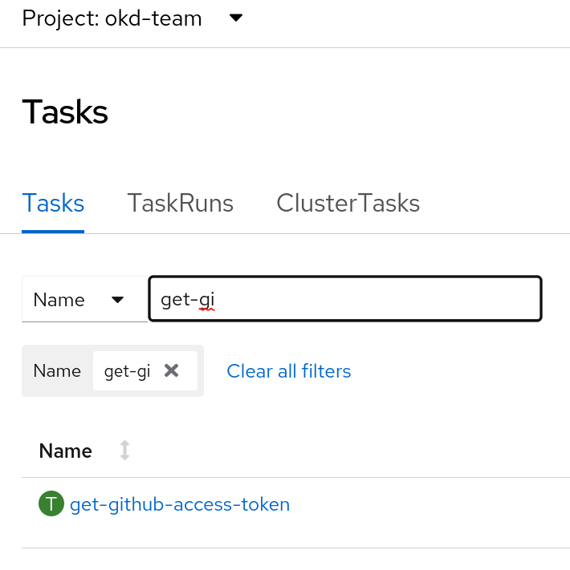
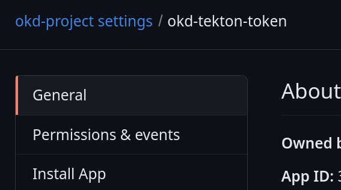

# Generation of GitHub token using GitHub Apps
The aim of this document is to show how to generate tokens using GitHub Apps to be consumed by Tekton pipelines.

## Creating a GitHub App

Only owners of the organization can create a GitHub App and then use this app for the repositories owned by the organization. 

Below all the steps needed to create a GitHub App

1. Logged in as a **owner** of the organization


2. Click on <kbd>Developer settings</kbd> and then <kbd>GitHub Apps</kbd>


3. Click on the <kbd>New GitHub App</kbd>


4. Choose a **GitHub App Name**, **description** and **Homepage URL** (if the app does not have a page, add the git repo URL)


5. Keep the option **Expire user authorization token** enabled:


6. Disable the **Webhook** option in case it will not be used


7. In the **Permissions** session choose the **Contents** since only releases permissions are needed (it is possible to change permissions later for other use cases). **Metadata** permission will be included automatically as Read-only (it is mandatory permission when 'Contents' is the selected option)




8. Keep **Only on this account** if it is not a public GitHub App and click on <kbd>Create GitHub App</kbd>


At this point the GitHub App is created and now it is necessary only to generate a private key.

9. Generate a private key for the GitHubApp clicking on **generate a private key**


10. Click on <kbd>Generate a private Key</kbd>. It will generate a private key and download a **.pem** file, save it in a safe place (it will be used as a kubernetes secret)

The file will looks like the one below:


## Installing the GitHub App in the organization repositories
After the creation of the GitHub App, it is possible to install it in the organization repositories that automation is needed. 

1. Click on <kbd>Install App</kbd>


    1.1 Install it on okd-project


2. Select only the repos where the GitHub App (okd-tekton-token) is needed. In this use case okd-project/okd-scos repo is selected and after that click on <kbd>Install</kbd> 


At this point the GitHub App (okd-tekton-token) is installed in the repo **okd-scos**. This GitHub App will be able to deliver token when requested by an external app.

## New Tekton Task
This sections shows the tekton task created to retrieve an access token calling the GitHub App created in the previous steps. Also, it shows the parameters required by this tekton task.

The name of the tekton task is get-github-access-token and showed in the picture below:



This is a generic pipeline and can be reused in other pipelines that want to retrieve an access token from a GitHub App, the mandatory field to reuse this tekton task are:

- github-app-id
- githubapp-secret-name
- github-app-installation-id

The parameter **github-app-id** is the ID of the GitHub App and only the organization owner has access to it. It can be found in the GitHub App settings



The parameter **githubapp-secret-name** is the name of the kubernetes secret that will store the private key generated in the Creating a GitHub App section

In our case the github-secret-name is **okd-githubapp-auth**:


The parameter **github-app-installation-id** is the ID generated by the installation of the GitHub App in a repository (since the GitHub App can be installed in more than one repository, the installation ID is the only way to identify which is the repo that the pipeline wants to call).

Call the tekton task get-github-access-token (which will fail because there is no github-app-installation-id yet) and get from the logs the **JWT** token returned.
    
Now it is possible to retrieve the **github-app-installation-id** by using the cURL command below, replace **<YOUR_TOKEN>** by the **JWT** token from the previous step.

```
curl -L \
  -H "Accept: application/vnd.github+json" \
  -H "Authorization: Bearer <YOUR-TOKEN>"\
  -H "X-GitHub-Api-Version: 2022-11-28" \
  https://api.github.com/app/installations
```

At this point it is possible to call the task in the pipeline as the example below:

```
    - name: get-github-access-token
      params:
        - name: github-app-id
          value: '<YOUR GITHUB APP ID HERE>'
        - name: github-app-installation-id
          value: '<YOUR GIT HUB APP INSTALLATION ID HERE>'
        - name: githubapp-secret-name
          value: <YOUR SECRET NAME WHERE THE PRIVATE KEY IS STORED>
      taskRef:
        kind: Task
        name: get-github-access-token
```

The task stores the token in a result and it can be reused in next tasks adding the follow parameter:

```
- name: token
  value: $(tasks.get-github-access-token.results.githubapp-token)
```

Where get-github-access-token is the name of the task defined in the pipeline. If the name of the task is different from the one above, please replace it with the name specified.

### What does get-github-access-token tekton task do? 
This section shows what are the steps performed by the get-github-access-token task 

1. Using the GitHub App ID and the private key, the tekton task calls GitHub App to retrieve a JWT token
2. Using the JWT token and the installation ID, the tekton task calls Github to retrieve an acess token
3. The access token is saved in results.githubapp-token and it can be used in the next tasks of the pipeline (for example to release a new version of OKD in github repo)


## What are the advantages of using GitHub App token? 

- The token is generated by the GitHub App which does not require a personal token 
    - Personal tokens should be avoided since people can leave the company or move to another teams
- The token has an short expiration so it means no one is able to use it after the pipeline finishes, making it safer
- A new token is generated every time the pipeline runs, it means there is no need of manual intervation as it is needed today when a personal token expires.

[From GitHub Blog:](https://github.blog/2022-10-18-introducing-fine-grained-personal-access-tokens-for-github/)
> For long-term automation needs, we recommend using GitHub Actions or GitHub Apps wherever possible. GitHub Apps provide the same highly targeted permissions options and administrator controls available with fine-grained PATs. They’re also long-lived, and they’re not associated with an individual user who may leave your company or project.

## References

- https://devopsjournal.io/blog/2022/01/03/GitHub-Tokens
- https://docs.github.com/en/apps/creating-github-apps/creating-github-apps/creating-a-github-app
- https://docs.github.com/en/apps/maintaining-github-apps/installing-github-apps
- https://docs.github.com/en/apps/creating-github-apps/authenticating-with-a-github-app/generating-an-installation-access-token-for-a-github-app
- https://docs.github.com/en/rest/apps/apps?apiVersion=2022-11-28#create-an-installation-access-token-for-an-app
- https://docs.github.com/en/rest/apps/apps?apiVersion=2022-11-28#list-installations-for-the-authenticated-app
- https://docs.github.com/en/apps/creating-github-apps/authenticating-with-a-github-app/generating-a-json-web-token-jwt-for-a-github-app